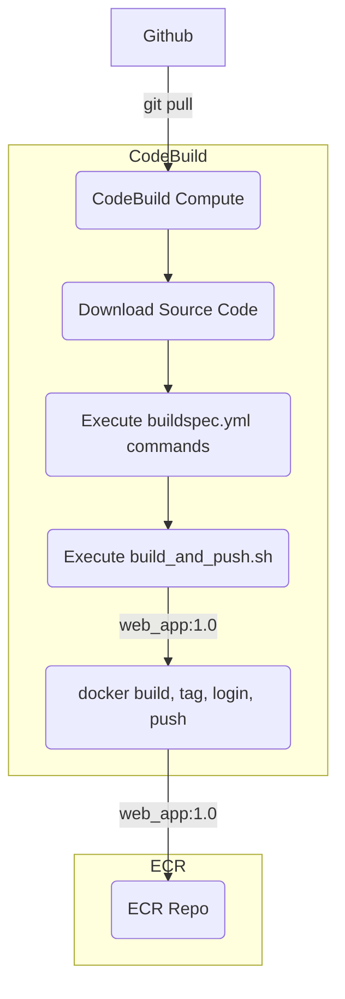

- [Docker Image Creation Pipeline](#docker-image-creation-pipeline)
  - [Sample Web App](#sample-web-app)
    - [Docker Setup](#docker-setup)
    - [Running the Project Locally](#running-the-project-locally)
  - [Configuration of Docker Image Creation Build Job](#configuration-of-docker-image-creation-build-job)
    - [Pre-Requisites](#pre-requisites)
    - [Executing CodeBuild Job](#executing-codebuild-job)
    - [Repository structure](#repository-structure)
    - [Executing Container created by Build Job](#executing-container-created-by-build-job)
    - [Change Implementation for Code](#change-implementation-for-code)
    - [CodeBuild Image Creation Build Pipeline Assignment](#codebuild-image-creation-build-pipeline-assignment)
    - [Image Creation Continuous Integration Pipeline Assignment](#image-creation-continuous-integration-pipeline-assignment)

---

# Docker Image Creation Pipeline
- This Project will create Docker Images and push the Docker Images to Amazon ECR repository. This will enable Continuos Integration Pipeline for Docker Images creation using CodeBuild Job.

## Sample Web App
- Add/validate the code having a Python file with name `app.py`.
- Place both the Python Application and requirements files in a folder and name it `src/`
- This project requires Python libraries to be installed for it to run.
- The libraries will be recorded in a `requirements.txt` file. This file will be used during docker build process.

--

### Docker Setup
- The **Dockerfile** required for this project mainly has to achieve the following logical steps:
  - Create base image
  - Copy source code
  - Install requirements and dependencies
  - Expose required port
  - Run the Streamlit app within the Docker environment

- Copy the Docker commands below in `Dockerfile`

```Dockerfile
FROM python:3.8-slim
ENV MICRO_SERVICE=/home/app/webapp

# set work directory
RUN mkdir -p $MICRO_SERVICE
# where your code lives

WORKDIR $MICRO_SERVICE
# set environment variables
ENV PYTHONDONTWRITEBYTECODE 1
ENV PYTHONUNBUFFERED 1

# install dependencies
RUN pip install --upgrade pip

# copy project
COPY src/ $MICRO_SERVICE
RUN pip install -r requirements.txt
EXPOSE 8501
CMD streamlit run app.py
```

--

### Running the Project Locally
- With both files set up, you are ready to build and run your image. To build your image, run the command

```bash
docker build -t python_web_app .
```
- After the docker image is built, we can run the Docker Image in detached mode.

```bash
docker run -d -p 8888:8501 python_web_app
```
- The app is now running at the IP Address and can be accessed on Browser with <IP>:8501.

--

## Configuration of Docker Image Creation Build Job



--

### Pre-Requisites
- Create a Github repository and upload the files using git bash and other git commands like `git add, git commit and git push`
- Create a Codebuild Project from AWS Console with below information:
    - For Operating system, choose Ubuntu.
    - For Runtime, choose Standard.
    - For Image, choose `aws/codebuild/standard:7.0`.
    - Since we have to use this build project to build a Docker image, select **Privileged** checkbox.

>Privileged :Enable this flag if you want to build Docker images or want your builds to get elevated privileges.

- Add Below Environment Variables in CodeBuild Project Configuration.
  - `DOCKER_IMAGE_NAME`

>Values for this environment variables will be passed during execution of CodeBuild Job

--

- Add below inline policy to Codebuild Project Role.

```bash
{
  "Version": "2012-10-17",
  "Statement": [{
    "Effect": "Allow",
    "Action": [
        "ecr:CreateRepository",
        "ecr:BatchCheckLayerAvailability",
        "ecr:CompleteLayerUpload",
        "ecr:GetAuthorizationToken",
        "ecr:InitiateLayerUpload",
        "ecr:PutImage",
        "ecr:UploadLayerPart",
        "ecr:DescribeRepositories"
      ],
    "Resource": "*"
  }]
}
```

--

### Executing CodeBuild Job
- Navigate to above created CodeBuild Job and click on **Start Build with overrides**
- Specify the branch name and provide values for environment variables : **DOCKER_IMAGE_NAME**
- Validate the CodeBuild Execution Logs for Docker Image Creation and if docker image created inside the CodeBuild Container is available in ECR Repository.
- Every Image inside a ECR Repo contains a Image URI similar to this : `ACCOUNT_ID.dkr.ecr.REGION_NAME.amazonaws.com/python_webapp-ecr-repo:python_webapp-5`

--

### Repository structure
 - `docker_python` - contains `buildspec.yml` file that will be used by CodeBuild Project
- `src` - contains web app code base for python and requirements.txt file, this will be used to install python packages using `pip`.
- `scripts` - contains `image_build_push.sh` file that has code to build image locally using `Dockerfile` and push it to ECR Repository.

>Note : Delete the Images in ECR Repo if its not used to avoid cost.

### Executing Container created by Build Job
- If you have pushed your docker image in Private ECR Repository, to pull image from ECR repository and execute a container using this image, you will require `docker login` authentication steps.
- Get the login using `aws ecr get-login-password --region us-east-1 | docker login --username AWS --password-stdin ACCOUNT_ID.dkr.ecr.REGION_NAME.amazonaws.com`
- Use below command to start container using the image that is pushed in ECR in the previous step
- `docker run -d -p 8888:8501 ACCOUNT_ID.dkr.ecr.REGION_NAME.amazonaws.com/python_webapp-ecr-repo:python_webapp-5`
- Validate the container python app browser with Public IP Address on port `8888`.

### Change Implementation for Code
If any application source code is to be modified, below generic steps can be followed.
- 1. Code has to be modified in Remote Git Repository in specific branch.
- 2. Execute the Build CI Pipeline to create new Docker Image that will copy newly updated Code into a new Docker Image and Push the Image into a Image Registry i.e `ECR/DockerHub`
- 3. Use this new IMAGE URI to execute the container and validate the changes.

### CodeBuild Image Creation Build Pipeline Assignment
- Refer above shell script and convert above shell script to use `ecr-public` commands to build and push Image in Amazon ECR Public Repo.

### Image Creation Continuous Integration Pipeline Assignment
- Refer above CI scenario and create a similar CI Pipeline for Image Creation with Source Control System as Github.